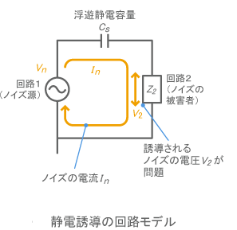

静電誘導
================================

一般に電圧を持った物体は、周囲に電界を作ります。この電界により周囲の回路が影響を受ける現象を、静電誘導と呼びます。
これを回路図で表すと、下図に示すように、ノイズ源から対象回路に対して浮遊静電容量CSが作られ、電流経路が作られていることになります。
静電誘導によるノイズの電圧V2は、ノイズ源の電圧Vnが大きいほど、浮遊静電容量CSが大きいほど大きくなります。
また、浮遊静電容量CSは、ノイズ源と対象回路の間の距離が小さいほど、ノイズ源や対象回路のサイズが大きいほど、大きくなります。

| 上記は以下サイトから抜粋引用しています。
| https://www.murata.com/ja-jp/products/emc/emifil/library/knowhow/basic/chapter05-p1