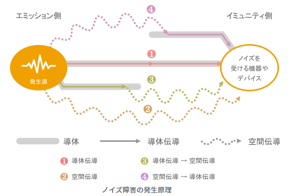
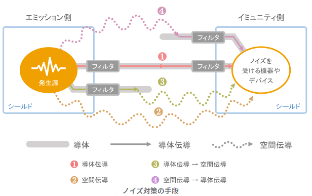

ノイズ対策の基本
================================

ノイズ障害は、下図に示すように、ノイズの発生源と、ノイズの影響受ける対象機器と、伝搬経路の3者が存在するときに発生します。
これらの要素のうちの一つを無くすことができれば、ノイズ障害は無くなります。
したがって、ノイズの発生源や対象機器で対策することも可能です。

例えば、デジタル回路やスイッチング電源、発信機などを一切使わなければ、電子機器の発生するノイズはごく小さくなります。
また、対象機器側でもソフトの冗長処理などで、多少情報が変化しても信号を回復できる場合があります。
これらの手段は根本解決になり得る場合もあるのですが、多くの場合は電子機器の性能を著しく劣化させたり、
大型になるなどの副作用が大きく、現実的ではありません。

そこで通常は、下図に示すように、伝搬経路でノイズを遮断することが行われています。ノイズの伝導には空間伝導と導体伝導の2種類がありますが、
図に示すように空間伝導にはシールドが、導体伝導にはフィルタが使われます。

空間伝導と導体伝導は、配線をアンテナとして相互に変換される性質があります。したがって、ある箇所で導体伝導だけが問題であったとしても、
空間伝導を全く配慮しないでよいということにはなりません。

| 上記内容は下記サイトから抜粋引用しています。
| https://www.murata.com/ja-jp/products/emc/emifil/library/knowhow/basic/chapter01-p1#03