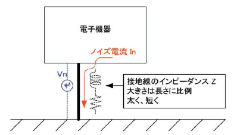
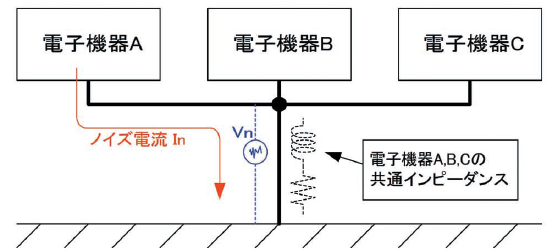
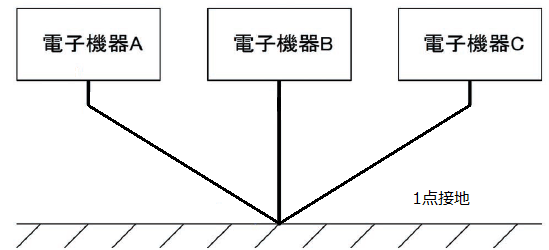
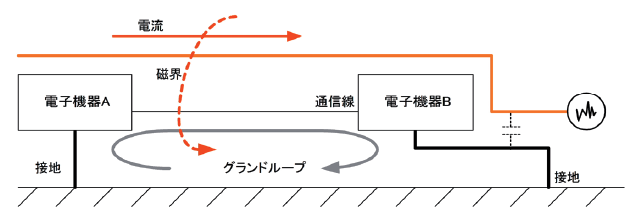

接地線からのノイズ
================================

大地は安定な電位であるため、電子機器の電位を安定させる目的で接地
をとりますが、接地の取り方によってはノイズ対策に対して逆効果になる
場合があります。

接地線のインピーダンス
********************************

接地線に電流が流れると接地抵抗や接地線のインピーダンスにより接地端子に電圧が発生します。
この電圧の変動により電子機器の電位が不安定になります。接地線に流れる電流値や周波数成分を考慮して、
接地抵抗や接地線のインピーダンスを下げる必要があります。
接地線のインピーダンスを下げるためには太く、短い線で接地をとります。

共通インピーダンスの影響
********************************

複数の電子機器をまとめて1本の接地線で接地を取るような場合には、接地抵抗や接地線のインピーダンスが
各電子機器の共通のインピーダンスとなります。
電子機器Aから接地線へ流れる電流により接地端子に発生したノイズ電圧Vnは他の電子機器B,C
の電位にも影響を及ぼすことになります。(下図参照)

電子機器B,C から接地線へ流れる電流により接地端子に発生する電圧についても同じことが言えます。
共通インピーダンスの影響についても、各電子機器から接地線に流れる電流値や周波数成分を考慮して、
接地抵抗や接地線のインピーダンスを下げる必要があります。

理想的には別々に接地をとります。それが困難であれば、独立した接地線をそれぞれの機器に接続し共通の接地点に
繋ぐ1点接地で他の機器からの影響を軽減出来ます。

グランドループの影響
********************************
接地線は下図の様に **グランドループ** を形成したり、長く引きまわすことで誘導によりノイズを拾いこみます。
また、一般的に電子機器は高周波ノイズでノイズ障害を起こすケースが多いため、電子機器の電位を安定させる目的で
接地を取る場合（機能接地）には、高周波ノイズに対して接地線のインピーダンスを低くする必要があります。

接地線のインピーダンスを低くするとノイズが侵入した際の接地端子の電圧変動を低く抑えることができます。
接地線のインピーダンスは長さに比例するためなるべく短く配線します。
