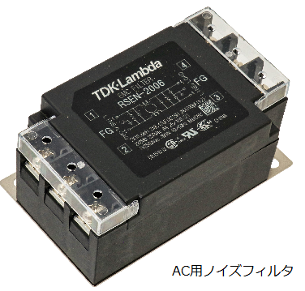

電源線ラインからのノイズ
================================

AC電源ラインには様々な機器が接続され電力を供給していますが、それと同時に様々な機器から出された
ノイズも侵入します。代表的なものが、各電子機器に使用されているスイッチング電源やインバータのノイズ、
リレーやモータなどのON/OFF 時に発生するノイズ、サージ等です。

また、商用電源ラインはAC電源を各機器に供給するため長く引き回され、誘導により周囲のノイズを拾い込みます。
AC電源ラインのノイズ対策は、AC電源ライン用のノイズフィルタやノイズ対策用の絶縁トランス等を用いてノイズが
AC電源ラインから電子機器に侵入しないようにします。

