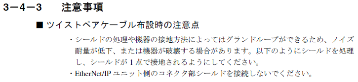
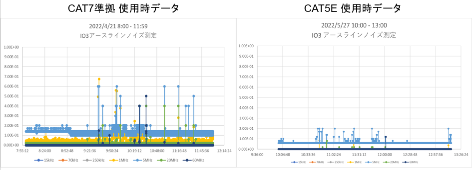

LANケーブルの変更
======================================

設計の問題点
************************************************

EtherNet/IP通信では制御機器間をLANケーブルで接続しネットワークを構成します。
当初ノイズ対策に効果があるとの認識で二重シールド施工されたLANケーブルを使って
いました。

ところが、このシールド線でグランドループが形成されてしまい外部ノイズの影響を
受け易くなっていました。この影響で通信ユニットの機能接地ラインの電位が変動
してしまい通信異常を発生させていました。

メーカの取り扱い説明書を確認するとネットワークを構成する時の注意事項としてLANケーブル
のシールドについて記載があります。

この中でLANケーブルの両端でシールドを介して通信機器の通信ポートと金属的に導通すると
グランドループが形成されてノイズ耐量が低下する旨下図の説明がありました。

対策
************************************************

LANケーブルをシールド施工の無いツイストペアタイプ（CAT5E)に変更しました。

下図の様にケーブル変更でノイズレベルは低下しています。

教訓
************************************************

- グランドループが出来るとノイズの影響を受け易くなる事を理解する事
- 機器の取扱説明書を熟読し、正しい使い方を良く理解する事

